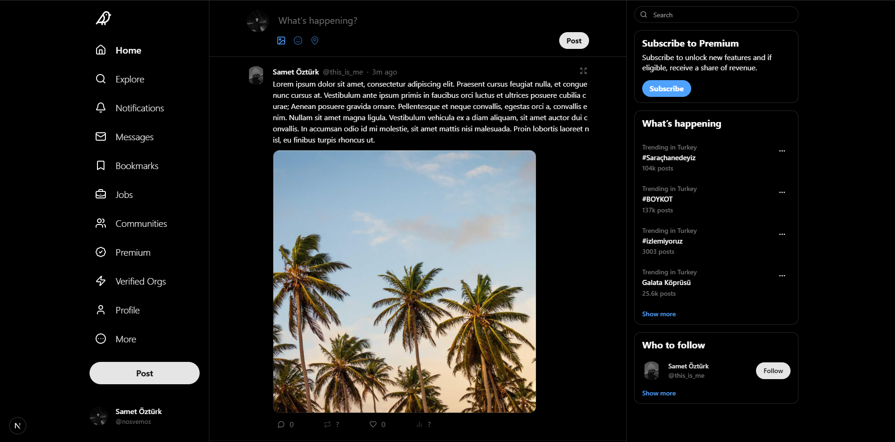
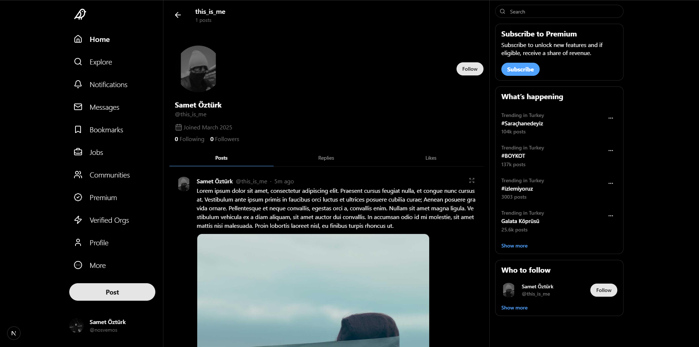
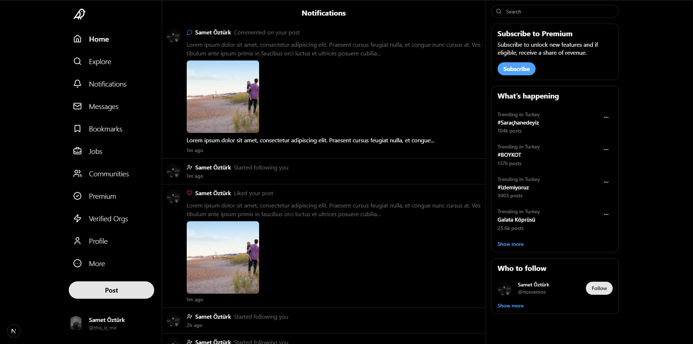

# Social App | Create posts, interact with users.

- 💻 Server Components, Layouts, Route Handlers, Server Actions
- 📡 API Integration using Route Handlers
- 🔄 Data Fetching, Caching & Revalidation
- 🎭 Client & Server Components
- 🛣️ Dynamic & Static Routes
- 🎨 Styling with Tailwind & ShadcnUI
- 🔒 Authentication & Authorization
- 🗃️ Database Integration with Prisma
- 🚀 Server Actions & Forms
- ⚡ Optimistic Updates

## Screenshots






## Technologies Used

**Frontend:** React, Tailwind CSS, ShadcnUI

**Backend:** Next.js

**Database:** Prisma, PostegreSQL

**Authentication:** Clerk

## Environment Variables

To run this project you will need to add the following environment variables to your .env file.

```
NEXT_PUBLIC_CLERK_PUBLISHABLE_KEY=
CLERK_SECRET_KEY=
DATABASE_URL=

NODE_ENV=production (optional)
```

## Run the app

```shell
npm run dev
```
